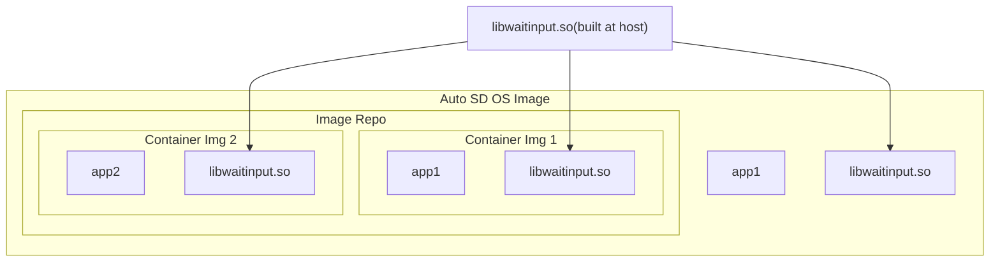

# Overview
This demo, based on https://github.com/alessandrocarminati/mem_chk_map, demonstrates file and memory deduplication during AutoSD image builds.

Summary of Demo Architecture  
1. The shared library `waitinput` is built on the host.
2. Two container images are created, each including the `waitinput` library.
3. An AutoSD **image** mode instance is built, containing the `waitinput` library and both container images.
4. Although the `waitinput` library appears as three separate copies from the application's perspective, the kernel recognizes and treats them as a single file.



# Get Started

Build the shared library:
```
# Build libwaitinput.so and save it in the _target folder
$ make lib

$ ls _target/
libwaitinput.so
```

Build two container images and copy the shared library into each image:
```
$ make container_images

$ podman images | grep mem_chk_map
localhost/mem_chk_map2                       latest               118abcbd69fa  2 minutes ago   168 MB
localhost/mem_chk_map1                       latest               9856f7a3ce55  2 minutes ago   168 MB
```

Build the OS image:
```
# Run `sudo rm -rf /var/cache/dnf/autosd*` if any error occurs
$ make build_os_image
```

Run the OS image:
```
# Start the OS image
$ make run_os_image

# Log in via SSH
$ sshpass -p password ssh -o StrictHostKeyChecking=no -o UserKnownHostsFile=/dev/null -p 2222 root@localhost
```

# Memory DeDuplication Demo

## Run the native application
```
# Build the app, linking it with the waitinput library
$ gcc -o /root/mem_chk_map0  -D END_WORD=\"end0\" /usr/gu/mem_chk_map.c -L=/usr/gu/_target -l=waitinput

# Run the application natively
$ LD_LIBRARY_PATH=/usr/gu/_target /root/mem_chk_map0
+-----------------------------------------+------+-----------+------------+--------------------------------+---------------------------------+
| Memory Region                           | Perms| Dev       | Inode      | content                        | PFNs (start/mid/end)            |
...
| 0x00007f2150b73000 - 0x00007f2150b74000 | r-xp | fe:03     | 303709     | .../gu/_target/libwaitinput.so | 0x7c875 / 0x7c875 / 0x7c875     |
...
Type 'end1' to exit:
```

## Run the application in a container
```
# Run container image1
$ podman run --rm -it --privileged mem_chk_map1
...
| 0x00007fa2098b6000 - 0x00007fa2098b7000 | r-xp | fe:03     | 303709     | /app/libwaitinput.so           | 0x7c875 / 0x7c875 / 0x7c875     |
...
Type 'end1' to exit:


# Run container image2
$ podman run --rm -it --privileged mem_chk_map2
...
| 0x00007fa2098b6000 - 0x00007fa2098b7000 | r-xp | fe:03     | 303709     | /app/libwaitinput.so           | 0x7c875 / 0x7c875 / 0x7c875     |
...
Type 'end1' to exit:
```

From the tests above, we observe that the code section of the `waitinput` library is always mapped to the same PFN (0x7c875) and inode (303709), regardless of whether it is loaded by the native application or by a containerized application. This demonstrates that the kernel recognizes all instances as the same underlying file, enabling memory deduplication.

# File DeDuplication Demo

The following commands show that inode 303709 actually corresponds to an object in the composefs repository. We also verify that the file accessed by the native application has the same SHA256 checksum as the object file in the repository, confirming file-level deduplication.

```
# Check that composefs is being used as the root filesystem
[root@localhost ~]# df -hT | grep composefs
composefs      overlay    12M   12M     0 100% /

# Identify the mount point and options for composefs
[root@localhost ~]# mount | grep composefs
composefs on / type overlay (ro,relatime,seclabel,lowerdir=/run/ostree/.private/cfsroot-lower::/sysroot/ostree/repo/objects,redirect_dir=on,verity=require,metacopy=on)

# Locate the object file in the OSTree repository by inode number
[root@localhost ~]# find /sysroot/ostree/repo/objects/ -inum 303709
/sysroot/ostree/repo/objects/41/044cac01909b325b530788ed9fb269a579ac2d7737cd8e7546b77a635d539d.file

# Calculate the SHA256 checksum of the shared library as seen by the application
[root@localhost ~]# sha256sum /usr/gu/_target/libwaitinput.so 
dfc20f5ada634293864affd91f612c6b13df230778d9c06676c4fea843308774  ...

# Calculate the SHA256 checksum of the corresponding object file in the repository
[root@localhost ~]# sha256sum /sysroot/ostree/repo/objects/41/044cac01909b325b530788ed9fb269a579ac2d7737cd8e7546b77a635d539d.file
dfc20f5ada634293864affd91f612c6b13df230778d9c06676c4fea843308774 ...
```
